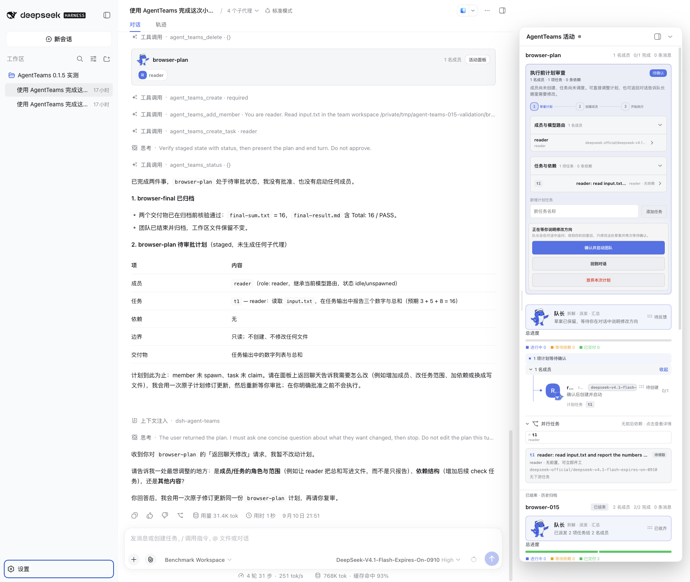
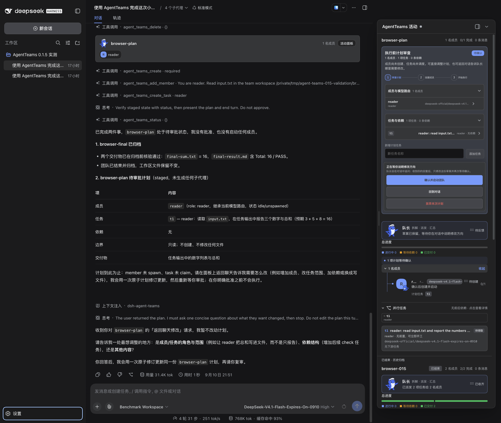

# AgentTeams 跟随 Harness 主题

本次适配随 `0.1.17` 发布；此前的 `0.1.17-rc.1` npm 包不包含这些修改。发布状态与产物证据见[发布记录](../releases/v0.1.17/README.md)。

## 宿主契约

以官方精确 tag `dsh-v0.1.5-rc.1` 及安装的同版 npm 包为依据：

- `ctx.theme.getTheme()` 返回当前快照；解析后的模式为 `snapshot.active.colorScheme`，不要把 `preference === 'system'` 当作实际颜色模式。
- `ctx.on('theme/change', snapshot => …)` 提供主题变化事件，覆盖手动选择、系统颜色变化和主题注册/覆盖变化。
- `ui-layout` 将实际模式写入 `html.style.colorScheme`；深色时设置 `body[data-ds-dark-theme]`，浅色时移除该属性。
- 宿主 CSS 定义深浅两套 `--dsw-alias-*` 语义变量；自定义主题覆盖由 presenter 写入 body。组件直接消费这些变量即可实时继承，无需额外主题状态、事件监听或 MutationObserver。

官方源码：[主题服务](https://github.com/deepseek-ai/deepseek-harness/blob/dsh-v0.1.5-rc.1/packages/client/ui-theme/src/client/index.ts)、[DOM presenter](https://github.com/deepseek-ai/deepseek-harness/blob/dsh-v0.1.5-rc.1/packages/client/ui-layout/src/client/theme-presenter.ts)、[调色板](https://github.com/deepseek-ai/deepseek-harness/blob/dsh-v0.1.5-rc.1/packages/client/ui-theme/src/styles/design-platform.css)。

## 插件修改

删除只覆盖 `.badge` / `.panel` 的旧变量桥接层。该层使用固定浅色的 static neutral 变量，而且对话卡片和移到面板外的弹窗无法继承它。活动面板、计划编辑器、卡片和弹窗按钮现在直接使用官方 border、layer、button、state 和 label 语义变量。阴影改用遮罩颜色，避免深色主题的浅色文字变量形成白色光晕。

没有增加宿主依赖或修改主题全局状态。使用到的 16 个颜色变量均存在于四个支持版本：`0.1.5-rc.1`、`0.1.2-rc.1`、`0.1.2-alpha.5`、`0.1.2-alpha.2`。后面三个版本本次核对的是精确 tag 变量可用性，没有重跑整套浏览器回归。

## 验证

`pnpm build`、`node scripts/verify.mjs` 和 `git diff --check` 通过。

Ego Lite 在独立 `/tmp` 测试实例中加载实际 `0.1.5-rc.1` 宿主与当前插件构建，复用此前真实 API 验收的团队会话。本次未新增模型调用，也未执行启动/停止团队等操作。

- 设置页浅色 → 深色 → 浅色，无刷新更新面板、卡片、成员按钮、模型标签及输入框。
- “跟随系统”响应浏览器模拟的 OS 浅色/深色变化；明确选择浅色时覆盖系统深色。
- 受控 body 语义变量覆盖可传入卡片、面板，以及位于面板外的生产弹窗按钮样式探针。这里验证 CSS 覆盖与继承，未安装第三方主题包或实际触发停止团队弹窗。
- 核对截图与 computed styles；面板阴影在两种模式下均为暗色。

数据见 [verification.json](verification.json)。

| 浅色 | 深色 |
| --- | --- |
|  |  |
